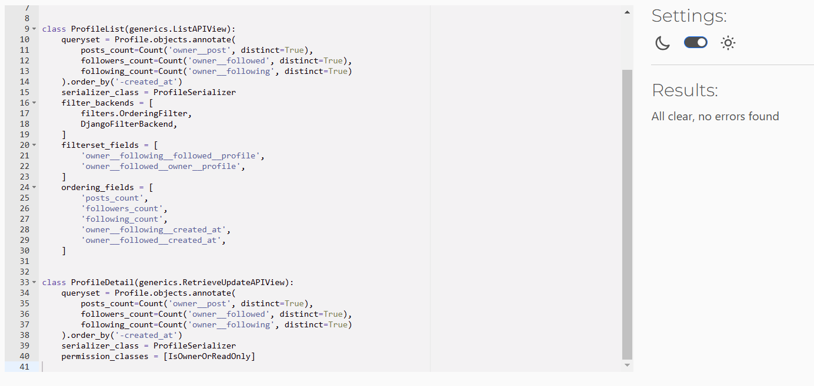
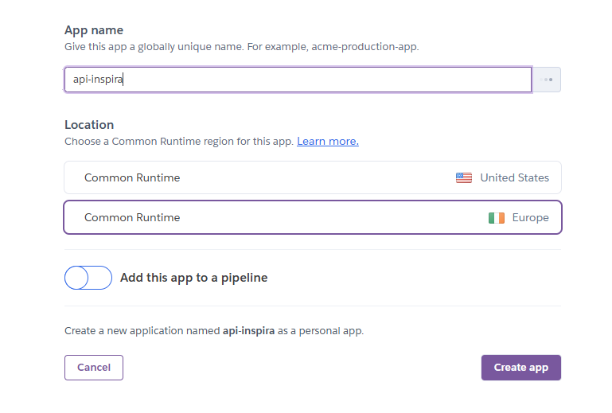

# Inspira - Django REST Framework API

This repository is the back-end API which used by my front-end application INSPIRA.
The API includes 2 custom models Profiles and Posts. All API endpoints will serve a specific purpose and will be tested to prevent any errors. 
Logged in users can create/edit/delete posts and comments.

You can rewiew the front-en application here - [Inspira](https://github.com/asyaharoyan/inspira)

## Contents

- [**Entity Relationship Diagram**](#entity-relationship-diagram)
- [**Database**](#database)
- [**Models**](#models)
- [**Testing**](#testing)
  - [**Manual Testing**](#manual-testing)
  - [**PEP8 Validation**](#pep8-validation)
  - [**Bugs Fixed**](#bugs-fixed)
  - [**Bugs Unresolved**](#bugs-unresolved)
- [**Technologies Used**](#technologies-used)
- [**Deployment To Heroku**](#deployment-to-heroku)
- [**Cloning This Project**](#cloning-and-setting-up-this-project)
- [**Credits**](#credits)
  - [**Content**](#content)
  - [**Media**](#media)
- [**Acknowledgments**](#acknowledgements)

# Entity Relationship Diagram

To visualize the connections between the models in the Inspira app, I have created a relationships diagram. This diagram provides a clear representation of how the models **Profiles, Posts, Comments, Followers, and Likes** interact with each other.

# Database

# Models

## Profiles model

The Profiles model is a custom model designed for the Inspira app. It stores all relevant information required for designers, architects, and painters to create and manage their professional profiles within the platform.
Each user in the app has a corresponding profile, establishing a one-to-one relationship with the built-in User model.

Relationships:

- One-to-One with the User model.
- One-to-Many with the Post model (a user can create multiple posts).
- Many-to-Many with the Follower model (a user can follow or be followed by others).

## Post model

The Post model is a custom model specifically designed for the Inspira app. It has been created to store all relevant data for a post, including details related to style, profession, and location, ensuring tailored functionality for the app's unique requirements.

Relationships:

- Many-to-One with the Profiles model (a profile can create multiple posts, but each post belongs to one profile).
- One-to-Many with the Comment model (a post can have multiple comments).
- One-to-Many with the Like model (a post can be liked by multiple users).

## Comment model

The Comment model is a pre-existing model sourced from a functional API. It stores information about the commenter, including their identity, the time the comment was made, and the content of the comment.

Relationships:

- Many-to-One with the Post model (each comment belongs to one post, but a post can have multiple comments).
- Many-to-One with the Profiles model (each comment is made by one profile, but a profile can make multiple comments).

## Like model

The Like model is a pre-existing model sourced from a functional API. It is responsible for storing data about users who have liked specific posts, capturing the relationship between users and their liked content.

Relationships:

- Many-to-One with the Post model (a post can be liked by multiple users, but each like is associated with one post).
- Many-to-One with the Profiles model (each like is associated with one profile, but a profile can like multiple posts).

## Follower model

The Follower model is a pre-existing model obtained from a functioning API. It is designed to store and manage data related to user followers, including relationships between users and their followers.

Relationships:

- Many-to-Many with the Profiles model (a profile can follow and be followed by multiple other profiles).

# Testing

  ## Manual Testing

  ## PEP8 Validation

  All the code has gone through PREP8 validation. There were a few errors which has been fixed.

  **api-inspira**

  permissions.py

  

  serializers.py

  

  views.py

  

  wsgi.py

  

  
  **comments**

  models.py

  

  serializers.py

  

  views.py

  

  **followers**

  models.py

  

  serializers.py

  

  views.py

  

  **likes**

  models.py

  

  serializers.py

  

  views.py

  

  **posts**

  models.py

  

  serializers.py

  

  views.py

  

  **profiles**

  models.py

  

  serializers.py

  

  views.py

  

  ## Bugs Fixed

  ## Bugs Unresolved

  There are no unresolved bugs.

# Technologies Used

In this project has been used **Python** programming language, **Django** framework and **Django REST** framework. 

# Deployment To Heroku

The project was deployed to Heroku. The deployment process is as follows:

Create a new repository in GitHub where the project files will be located.

Once the repository has been crated, it has been pulled to GitPod.

Now it's time to install Django and some additional packages

 - Install Django by typing pip3 install 'django<4'
 - Create a new project by typing django-admin startproject api_inspira
 - Install cloudinary storage by typing pip3 install django-cloudinary-storage
 - Install Pillow by typing pip3 install Pillow

Add the newly installed apps to settings.py file

    INSTALLED_APPS = [
      'django.contrib.admin',
      'django.contrib.auth',
      'django.contrib.contenttypes',
      'django.contrib.sessions',
      'django.contrib.messages',
      'cloudinary_storage',
      'django.contrib.staticfiles',
      'cloudinary'
    ]

Create a new **env.py** file and paste in the following code - remembering to change the "YOUR CLOUDINARY URL HERE" part to your API key.

    os.environ["CLOUDINARY_URL"] = "YOUR CLOUDINARY_URL_HERE"

Back in **settings.py** file import env.py file if it exists.

    import os

    if os.path.exists("env.py"):
      import env

Reference Cloudinary URL in **settings.py**

    CLOUDINARY_STORAGE = {"CLOUDINARY_URL": os.environ.get("CLOUDINARY_URL")}

Define MEDIA_URL and DEFAULT_FILE_STORAGE in **settings.py**

    MEDIA_URL = "/media/"

    DEFAULT_FILE_STORAGE = "cloudinary_storage.storage.MediaCloudinaryStorage"

Create new applications. For this project 5 seperate applications has been created

    comments
    followers
    likes
    posts
    profiles

Add these applications to the INSTALLED_APPS variable in **settings.py**

After finishing development of the applications, move onto the next deployment steps

First install JSON Web Token Authentication

    In the terminal type pip3 install dj-rest-auth

Add both rest framework’s auth token and django rest auth to INSTALLED APPS

    INSTALLED_APPS = [
      ...
      "rest_framework.authtoken",
      "dj_rest_auth",
      ...
    ]

Add the urls to the urlpatterns list **path('dj-rest-auth/', include('dj_rest_auth.urls'))**

    urlpatterns = [
    path("dj-rest-auth/", include("dj_rest_auth.urls")),
    ]

Migrate the database by typing python3 manage.py migrate

Install Django All Auth with the following command - pip3 install 'dj-rest-auth' and add the new application to the INSTALLED_APPS vairable in **settings.py**

    INSTALLED_APPS = [
      ...
      "django.contrib.sites",
      "allauth",
      "allauth.account",
      "allauth.socialaccount",
      "dj_rest_auth.registration",
      ...
    ]

Add a SITE_ID = 1 variable in **settings.py**

Add the registration urls to the urlpatterns list

    urlpatterns = [
      path('dj-rest-auth/registration/', include('dj_rest_auth.registration.urls')),
    ]

In the terminal type in the following command **pip3 install djangorestframework-simplejwt** to add JWT tokens functionality.

In **env.py** add os.environ['DEV'] = '1'

In **settings.py** set the DEBUG value equal to the DEV variable in **env.py**

    DEBUG = 'DEV' in os.environ

In **settings.py** add the following code differentiate between development and production modes and also set the date time format

    REST_FRAMEWORK = {
    'DEFAULT_AUTHENTICATION_CLASSES': [(
        'rest_framework.authentication.SessionAuthentication'
        if 'DEV' in os.environ
        else 'dj_rest_auth.jwt_auth.JWTCookieAuthentication'
    )],
    'DEFAULT_PAGINATION_CLASS':
        'rest_framework.pagination.PageNumberPagination',
    'PAGE_SIZE': 10,
    'DATETIME_FORMAT': '%d %b %Y',
    }

Add the following code to **settings.py** to enable token authentication, cookie declaration and to also ensure that the tokens are sent over HTTPS only

    REST_USE_JWT = True
    JWT_AUTH_SECURE = True
    JWT_AUTH_COOKIE = 'my-app-auth'
    JWT_AUTH_REFRESH_COOKIE = 'my-refresh-token'
    JWT_AUTH_SAMESITE = 'None'

Create a new root route which will act as a welcome screen to anyone who visits the root route of the API

Create a new **views.py** file in the main project folder (api_inspira) and add the following code

        @api_view()
        def root_route(request):
        """
        Function to return a welcome message
        upon loading the API
        """
        return Response({
            "message": "Welcome to ISNPIRA API!"
        })

Add that new route to the urlpatterns list in the main **urls.py** file

    from .views import root_route

    urlpatterns = [
    path('', root_route),
    ...
    ]

Create a new production database with **ElephantSQL**

- Log into ElephantSQL
- Click Create New Instance
- Give your plan a name
- Select *Tiny Turtle (Free) plan
- Click Select Region and pick a data center near you
- Click Review, double check the information, click **Create Instance**

Return to the dashboard, find the created plan and copy the URL

Back in local project, in **eny.py** add the copied production database URL and store it in a new variable which can be referenced without exposing the value to unwanted eyes

    os.environ.setdefault(
    "DATABASE_URL", "YOUR DB URL HERE",
    )

In the terminal, type in pip install dj_database_url

After that has installed, we need to import it into our main **settings.py** file **import dj_database_url**

Seperate the development and production environment databases with the following code

    if 'DEV' in os.environ:
        DATABASES = {
            'default': {
                'ENGINE': 'django.db.backends.sqlite3',
                'NAME': BASE_DIR / 'db.sqlite3',
            }
        }
    else:
        DATABASES = {
            'default': dj_database_url.parse(os.environ.get("DATABASE_URL"))
        }

Install gunicorn. In the terminal type **pip3 install gunicorn**

Create a **Procfile** at the root level in the projcet and add the following code

        release: python manage.py makemigrations && python manage.py migrate
        web: gunicorn api_inspira.wsgi

In **settings.py** add ALLOWED_HOSTS

    ALLOWED_HOSTS = [
    '8000-asyaharoyan-apiinspira-1it4vsdlfh7.ws.codeinstitute-ide.net',
    os.environ.get('ALLOWED_HOST'),
    ]

Install CORS by typing pip3 install django-cors-headers and then add it to the INSTALLED_APPS

Add it to the MIDDLEWARE list - it is important that it is placed at the top of the list

    MIDDLEWARE = [
        'corsheaders.middleware.CorsMiddleware',
        ...
        ]

In **settings.py** file add the ALLOWED_ORIGINS for the network requests

    if 'CLIENT_ORIGIN' in os.environ:
        CORS_ALLOWED_ORIGINS = [
            os.environ.get('CLIENT_ORIGIN')
        ]
    if 'CLIENT_ORIGIN_DEV' in os.environ:
        CORS_ALLOWED_ORIGIN_REGEXES = [r"^https://.*\.codeinstitute-ide\.net$", ]

    CORS_ALLOW_CREDENTIALS = True

    ROOT_URLCONF = 'api_inspira.urls'

Create a new SECRET_KEY in **env.py** and replace it in **settings.py**

**env.py**

    os.environ.setdefault("SECRET_KEY", "YOUR SECRET KEY HERE")

**settings.py**

    SECRET_KEY = os.getenv("SECRET_KEY")

Update the requirements.txt file by typing **pip3 freeze > requirements.txt**

Git add, commit and push the project to GitHub

Deploy the project in **Heroku** by doing the following steps

- Navigate to **Heroku**
- Click New App
- Fill in the information
- Click create
The name of the app should be uniqe

Add Config Vars in settings

Link **Heroku** application with **Github** project

- Click on the **Deploy** tab
- Choose **GitHub**
- Find the repository
- Click **Connect**

After connecting the project click on **Deploy Branch**

# Credits

This project was inspired by and developed following the **Code Institute** DRF-API walkthrough. It has been customized and modified to meet the specific requirements of the **Inspira** project.
All the images featured on the website showcase real-life projects completed by me during my professional career.

